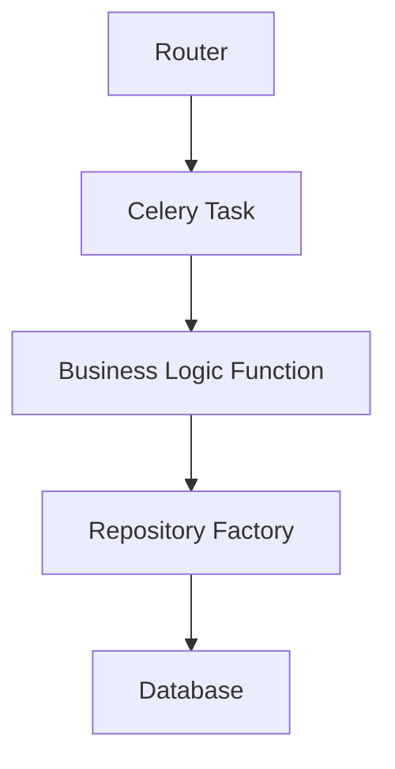

# 🏗️ Arquitectura Background Tasks - Adelanta Backend Toolbox

> **🔧 Basado en Celery**: Esta arquitectura utiliza Celery como motor de tareas asíncronas distribuidas, proporcionando escalabilidad y confiabilidad para procesamiento en background.

## 📋 **Índice**

1. [📁 Estructura de Carpetas](#-estructura-de-carpetas)
2. [🔄 Flujo de Responsabilidades](#-flujo-de-responsabilidades)
3. [📋 Patrón de Implementación](#-patrón-de-implementación)
4. [🎯 Principios de Arquitectura](#-principios-de-arquitectura-actualizados)
    - [✅ Patrón Estándar para Endpoints /execute](#-patrón-estándar-para-endpoints-execute)
    - [✅ Detección Automática de Tasks](#-detección-automática-de-tasks)
    - [✅ Configuración de Importación](#-configuración-de-importación)
5. [🚀 Comandos de Ejecución](#-comandos-de-ejecución)
6. [🧪 Testing](#-testing)
7. [📚 Convenciones de Nomenclatura](#-convenciones-de-nomenclatura)
8. [🛠️ Troubleshooting y Guías](#-troubleshooting-y-guías)

## 📁 **Estructura de Carpetas**

```bash
adelanta-backend-toolbox/
├── models/          # ORM Models (SQLAlchemy)
├── repositories/    # Acceso a datos
├── services/        # Lógica de negocio
├── routers/         # Endpoints FastAPI
├── schemas/         # Validación Pydantic
├── config/          # Configuraciones
│   └── celery_config.py      # ✅ Solo configuración Celery
├── background/               # 🆕 Todo lo relacionado con Celery
│   ├── tasks/                # 📋 Tasks organizadas por dominio
│   │   └── toolbox/         # 🧰 Tasks de toolbox
│   │       ├── __init__.py
│   │       ├── kpi_acumulado_task.py
│   │       ├── tablas_reportes_task.py
│   │       ├── tablas_cxc_task.py
│   │       ├── etl_task.py
│   │       ├── tipo_cambio_task.py
│   │       └── ... (A-Z tasks)
│   ├── processors/           # 🧠 Lógica de negocio pura
│   │   ├── base_processor.py         # 🆕 Clase base con get_task_status() centralizada
│   │   └── toolbox/         # 🧰 Processors de toolbox
│   │       ├── __init__.py
│   │       ├── kpi_acumulado_processor.py
│   │       ├── tablas_reportes_processor.py
│   │       ├── tablas_cxc_processor.py
│   │       ├── etl_processor.py
│   │       ├── tipo_cambio_processor.py
│   │       └── ... (A-Z processors)
│   ├── routers/              # 🎮 API Endpoints específicos de Background
│   │   ├── base_router.py            # 🆕 Router central: /status/{task_id} y /available
│   │   └── toolbox/         # 🧰 Routers de toolbox
│   │       ├── __init__.py
│   │       ├── kpi_acumulado_router.py
│   │       ├── tablas_reportes_router.py
│   │       ├── tablas_cxc_router.py
│   │       └── ... (A-Z routers)
│   └── schemas/              # 📋 Schemas específicos de Background
│       ├── __init__.py
│       └── task_schema.py    # 🔄 Schemas genéricos para tasks
└── pytest/
```

## 🔄 **Flujo de Responsabilidades**



### **1. Router (API Endpoints)**

-   **Ubicación**: `background/routers/toolbox/`
-   **Responsabilidad**: Exponer endpoints HTTP específicos de Background Tasks
-   **Ejemplo**: `POST /tasks/execute/kpi-acumulado`

### **2. Celery Task (Orquestación + Business Logic)**

-   **Ubicación**: `background/tasks/toolbox/`
-   **Responsabilidad**: Task de Celery + Lógica de negocio completa
-   **Características**: Manejo de errores Celery, retries, serialización + Business Logic

### **3. Repository Factory (Acceso a Datos)**

-   **Ubicación**: `config/repository_factory.py`
-   **Responsabilidad**: Crear repositories con sesiones aisladas para Celery
-   **Características**: Pool optimizado, cleanup automático

### **4. Processor (OPCIONAL - Solo Wrapper)**

-   **Ubicación**: `background/processors/toolbox/`
-   **Responsabilidad**: Wrapper de compatibilidad (NO lógica de negocio)
-   **Características**: Solo llama al Task de Celery, mantiene interfaz original
-   **BaseProcessor**: Clase base con lógica centralizada de `get_task_status()` y formateo

## 📋 **Patrón de Implementación**

### **Task (Business Logic + Celery)**

```python
# background/tasks/toolbox/kpi_acumulado_task.py
from config.repository_factory import create_repository_factory

@celery_app.task(name="toolbox.kpi_acumulado", bind=True, max_retries=0)
def kpi_acumulado_task(self):
    """📋 Task con lógica de negocio completa"""
    try:
        result = asyncio.run(_actualizar_kpi_acumulado_logic())
        return {"status": "success", "records": result.get("records", 0)}
    except Exception as e:
        return {"status": "failed", "error": str(e)}

async def _actualizar_kpi_acumulado_logic():
    """Lógica de negocio usando repository_factory"""
    repo_factory = create_repository_factory()
    try:
        tipo_cambio_repo = await repo_factory.create_tipo_cambio_repository()
        # ... lógica de negocio aquí
        return {"records": len(results)}
    finally:
        await repo_factory.cleanup()
```

### **Repository Factory (Acceso a Datos)**

```python
# config/repository_factory.py
class RepositoryFactory:
    """Factory para crear repositories con sesiones aisladas"""

    async def create_tipo_cambio_repository(self):
        session = await self.get_db_session()
        return TipoCambioRepository(session)

    async def cleanup(self):
        """Limpiar recursos"""
        if self._session:
            await self._session.close()
```

### **Router (API Wrapper)**

```python
# background/routers/base_router.py - Router centralizado
@router.get("/status/{task_id}")
async def get_status(task_id: str):
    """🎯 Status centralizado para cualquier task"""
    return BaseProcessor.format_task_response(task_id)

@router.get("/available")
async def list_available_tasks():
    """📋 Lista automática de todas las tasks disponibles"""
    return BaseProcessor.get_available_tasks()

# background/routers/toolbox/kpi_acumulado_router.py - Router específico
@router.post(
    "/execute",
    response_model=TaskExecuteResponse,
    response_class=ORJSONResponse,
    summary="🚀 Ejecutar [Nombre Task]",
    description="Ejecuta la actualización de [descripción] usando Celery",
)
async def execute_task():
    """� Control remoto para ejecutar [Task] bajo demanda"""
    try:
        logger.info("�🎮 API: Iniciando ejecución remota de [Task]...")

        # Instanciar el wrapper de Celery
        processor = TaskProcessor()

        # Ejecutar task
        result = await processor.run()

        logger.info(f"✅ API: Task enviada exitosamente - ID: {result['task_id']}")

        return TaskExecuteResponse(
            success=True,
            task_id=result["task_id"],
            message="Task [nombre] enviada a Celery exitosamente",
            task_name="nombre_task",
        )

    except Exception as e:
        logger.error(f"❌ API: Error ejecutando [Task]: {str(e)}")
        raise HTTPException(status_code=500, detail=f"Error ejecutando task: {str(e)}")
```

### **Processor (OPCIONAL - Solo Wrapper)**

```python
# background/processors/base_processor.py
class BaseProcessor:
    """🔄 Clase base con lógica centralizada para Celery task status"""

    def get_task_status(self, task_id: str) -> Dict[str, Any]:
        """Lógica centralizada para obtener estado de Celery tasks"""

    @staticmethod
    def format_task_response(task_id: str) -> TaskStatusResponse:
        """Método estático para formatear respuestas desde routers directos"""

# background/processors/toolbox/kpi_acumulado_processor.py
class KPIAcumuladoProcessor(BaseProcessor):
    """🔄 Wrapper de compatibilidad - hereda get_task_status()"""

    async def run(self):
        """Solo llama al task de Celery"""
        result = kpi_acumulado_task.delay()
        return {"status": "enqueued", "task_id": result.id}
```

### **Schemas (Validación)**

```python
# background/schemas/task_schema.py
class TaskExecuteResponse(BaseModel):
    success: bool
    task_id: str
    message: str
    task_name: str

class TaskStatusResponse(BaseModel):
    task_id: str
    status: str
    result: Optional[Any] = None
    ready: bool
    successful: Optional[bool] = None
    failed: Optional[bool] = None
    error: Optional[str] = None
```

## 🎯 **Principios de Arquitectura ACTUALIZADOS**

### **✅ PATRÓN ESTÁNDAR PARA ENDPOINTS /execute**

**🎯 Estructura Obligatoria para todos los routers:**

```python
@router.post(
    "/execute",
    response_model=TaskExecuteResponse,
    response_class=ORJSONResponse,
    summary="🚀 Ejecutar [Nombre Task]",
    description="Ejecuta la actualización de [descripción específica] usando Celery",
)
async def execute_[nombre]_task():
    """🎯 Control remoto para ejecutar [Task] bajo demanda"""
    try:
        logger.info("🎮 API: Iniciando ejecución remota de [Task]...")

        # Instanciar el wrapper de Celery
        processor = [TaskName]Processor()

        # Ejecutar task
        result = await processor.run()

        logger.info(f"✅ API: Task enviada exitosamente - ID: {result['task_id']}")

        return TaskExecuteResponse(
            success=True,
            task_id=result["task_id"],
            message="Task [nombre] enviada a Celery exitosamente",
            task_name="[nombre]_task",
        )

    except Exception as e:
        logger.error(f"❌ API: Error ejecutando [Task]: {str(e)}")
        raise HTTPException(status_code=500, detail=f"Error ejecutando task: {str(e)}")
```

**📋 Elementos Obligatorios:**

-   ✅ `response_class=ORJSONResponse` - Performance optimizada
-   ✅ `summary` y `description` descriptivos con emojis
-   ✅ Logging detallado de inicio y resultado
-   ✅ Try/catch robusto con HTTPException
-   ✅ Uso del Processor correspondiente (no task directo)
-   ✅ Formateo consistente del TaskExecuteResponse

### **✅ DETECCIÓN AUTOMÁTICA DE TASKS**

**🎯 Sistema de Auto-Discovery:**

-   **ANTES**: Lista manual de tasks en cada router → duplicación de código
-   **DESPUÉS**: Detección automática desde registro de Celery → sin duplicación

**🔧 Implementación en BaseProcessor:**

```python
@staticmethod
def get_available_tasks() -> Dict[str, Any]:
    """
    🎯 Detección automática de tasks desde registro de Celery
    ✅ Multi-patrón: busca 'toolbox.', 'background.'
    ✅ Logging detallado + manejo robusto de errores
    ✅ Fallback automático a lista manual
    """
    try:
        registered_tasks = celery_app.tasks
        background_task_patterns = ["toolbox.", "background."]

        # Filtrar tasks de background
        background_tasks = {
            name: task for name, task in registered_tasks.items()
            if any(name.startswith(pattern) for pattern in background_task_patterns)
            and not name.startswith("celery.")
        }

        # Procesar cada task para generar metadata
        available_tasks = {}
        for task_name, task_obj in background_tasks.items():
            clean_name = task_name.replace("toolbox.", "").replace("background.", "")
            endpoint = f"/tasks/execute/{clean_name.replace('_', '-')}"

            available_tasks[clean_name] = {
                "name": task_name,
                "description": extract_description(task_obj),
                "endpoint": endpoint,
                "method": "POST",
                "module": getattr(task_obj, "__module__", "Unknown"),
            }

        return {
            "success": True,
            "available_tasks": available_tasks,
            "total_tasks": len(available_tasks),
            "auto_generated": True,
        }
    except Exception as e:
        # Fallback automático a lista manual
        return BaseProcessor._get_manual_tasks_list()
```

**📊 Respuesta API /tasks/available:**

```json
{
    "success": true,
    "available_tasks": {
        "kpi_acumulado": {
            "name": "toolbox.kpi_acumulado",
            "description": "🎯 Task Celery: Actualizar KPI Acumulado",
            "endpoint": "/tasks/execute/kpi-acumulado",
            "method": "POST",
            "module": "background.tasks.toolbox.kpi_acumulado_task"
        },
        "kpi": {
            "name": "toolbox.kpi",
            "description": "Actualiza tablas de reportes",
            "endpoint": "/tasks/execute/kpi",
            "method": "POST",
            "module": "background.tasks.toolbox.kpi_task"
        }
    },
    "total_tasks": 4,
    "auto_generated": true
}
```

### **✅ CONFIGURACIÓN DE IMPORTACIÓN**

**🔧 Celery Config Actualizado:**

```python
# config/celery_config.py
celery_app = Celery(
    "adelanta-toolbox",
    include=[
        "background.tasks.toolbox",  # 🆕 Tasks del directorio background
        "config.celery_tasks",       # Legacy para compatibilidad
    ],
)
```

**📋 Import Centralizado:**

```python
# background/tasks/toolbox/__init__.py
from .kpi_acumulado_task import actualizar_kpi_acumulado_task
from .kpi_task import actualizar_tablas_reportes_task
from .tablas_reportes_task import tablas_reportes_task
from .tablas_cxc_task import tablas_cxc_task

__all__ = [
    "actualizar_kpi_acumulado_task",
    "actualizar_tablas_reportes_task",
    "tablas_reportes_task",
    "tablas_cxc_task",
]
```

### **✅ DECISIÓN FINAL: Tasks Con Lógica de Negocio**

-   **Tasks**: Contienen toda la lógica de negocio + orquestación Celery
-   **Repository Factory**: Maneja acceso a datos con sesiones aisladas
-   **Routers**: Solo endpoints HTTP que llaman a Tasks
-   **Processors**: OPCIONALES - Solo wrappers de compatibilidad (NO lógica de negocio)

### **✅ Patrón Repository Factory**

-   **NO usar `@inject`**: Usar `repository_factory` en su lugar
-   **Sesiones aisladas**: Cada task tiene sus propios repositories
-   **Cleanup automático**: `finally` block para limpiar recursos
-   **Pool optimizado**: Configuración específica para Celery

### **✅ Estructura Simplificada**

```bash
background/
├── tasks/           # 📋 Celery Tasks CON lógica de negocio
├── routers/         # 🎮 API Endpoints (llaman a tasks o BaseProcessor.format_task_response)
├── processors/      # 🔄 OPCIONAL: Wrappers de compatibilidad (heredan de BaseProcessor)
│   └── base_processor.py  # 🆕 Lógica centralizada get_task_status() + formateo
└── schemas/         # 📋 Schemas de validación
```

### **✅ Patrón BaseProcessor Centralizado**

-   **BaseProcessor**: Centraliza `get_task_status()` y formateo de respuestas
-   **Herencia**: Todos los processors heredan de BaseProcessor
-   **Método estático**: `BaseProcessor.format_task_response()` para routers directos
-   **Eliminación duplicación**: ~150 líneas de código duplicado eliminadas

## 🎯 **Flujo Centralizado ACTUALIZADO**

### **Opción A: Router con Processor (KPI Acumulado)**

```python
# background/routers/toolbox/kpi_acumulado_router.py
@router.get("/status/{task_id}")
async def get_status(task_id: str):
    processor = KPIAcumuladoProcessor()
    return processor.get_formatted_task_status(task_id)  # 📋 Formateo centralizado
```

### **Opción B: Router Directo (Tablas Reportes/CXC)**

```python
# background/routers/toolbox/tablas_reportes_router.py
@router.get("/status/tablas-reportes/{task_id}")
async def get_status(task_id: str):
    return BaseProcessor.format_task_response(task_id)  # 📋 Método estático centralizado
```

### **✅ Beneficios de la Centralización**

-   **📊 Consistencia**: Mismo formato de respuesta entre todos los endpoints
-   **🔧 Mantenibilidad**: Un solo lugar para modificar lógica de status
-   **📉 Duplicación**: Eliminadas ~150 líneas de código duplicado
-   **🛡️ Robustez**: Manejo de errores unificado y robusto
-   **🤖 Automatización**: Lista de tasks extraída automáticamente desde celery_app
-   **🔄 Fallback**: Sistema de respaldo manual en caso de errores

### **🤖 Automatización de Tasks**

```python
# Método automatizado en BaseProcessor
@staticmethod
def get_available_tasks():
    """Extrae automáticamente tasks desde celery_app.tasks"""
    registered_tasks = celery_app.tasks
    background_tasks = {
        name: task for name, task in registered_tasks.items()
        if name.startswith('toolbox.') or name.startswith('background.')
    }
    # Procesa automáticamente: name, description, endpoint, module
```

### **📍 Endpoints Centralizados**

```bash
# ANTES: Duplicados en cada router
/toolbox/status/{task_id}           # En cada router específico
/toolbox/available                  # En cada router específico

# DESPUÉS: Centralizados en base_router
/tasks/status/{task_id}             # ✅ Centralizado - funciona para cualquier task
/tasks/available                    # ✅ Centralizado - lista automática desde Celery
```

## 🚀 **Comandos de Ejecución**

### **Desarrollo**

```bash
# Ejecutar worker
uv run celery -A config.celery_config worker --loglevel=info --queues=cronjobs,default

# Ejecutar scheduler
uv run celery -A config.celery_config beat --loglevel=info
```

### **API Endpoints**

```bash
# Ejecutar task
POST /tasks/execute/kpi-acumulado

# Consultar estado
GET /tasks/status/{task_id}

# Listar tasks disponibles
GET /tasks/available
```

## 🧪 **Testing**

### **Test Processor (Sin Celery)**

```python
def test_kpi_processor():
    processor = KPIAcumuladoProcessor()
    result = asyncio.run(processor.process())
    assert result["records"] > 0
```

### **Test Task (Con Celery)**

```python
def test_kpi_task():
    result = kpi_acumulado_task()
    assert result["status"] == "success"
```

## 📚 **Convenciones de Nomenclatura**

### **Archivos y Clases**

-   **Task**: `kpi_acumulado_task.py` → `kpi_acumulado_task()`
-   **Processor**: `kpi_acumulado_processor.py` → `KPIAcumuladoProcessor`
-   **Router**: `kpi_acumulado_router.py` → endpoints relacionados
-   **Schema**: `task_schema.py` → schemas genéricos para tasks

### **Imports**

```python
# ✅ CORRECTO - Sin conflicto con librería celery
from background.tasks.toolbox.kpi_acumulado_task import kpi_acumulado_task
from background.processors.toolbox.kpi_acumulado_processor import KPIAcumuladoProcessor
from background.routers.toolbox.kpi_acumulado_router import router
from background.schemas.task_schema import TaskExecuteResponse, TaskStatusResponse

# ✅ CORRECTO - Librería externa
from celery import Celery
import celery
```

## 🎯 **Migración Actual → Nueva Estructura CORREGIDA**

### **Mapeo de Archivos**

```bash
# ANTES:
cronjobs/datamart/ActualizarTablasReportesCronjob.py  # Con @inject
cronjobs/datamart/ActualizarTablasCXCCronjob.py       # Con @inject

# DESPUÉS:
background/tasks/toolbox/tablas_reportes_task.py     # Con repository_factory + lógica completa
background/tasks/toolbox/tablas_cxc_task.py          # Con repository_factory + lógica completa
background/routers/toolbox/tablas_reportes_router.py # API endpoints
background/routers/toolbox/tablas_cxc_router.py      # API endpoints
background/processors/toolbox/tablas_reportes_processor.py # OPCIONAL: Solo wrapper
background/processors/toolbox/tablas_cxc_processor.py     # OPCIONAL: Solo wrapper
```

### **Patrón de Migración**

1. **Copiar lógica original** → `background/tasks/toolbox/xxx_task.py`
2. **Reemplazar `@inject`** → `repository_factory`
3. **Agregar Celery wrapper** → `@celery_app.task`
4. **Crear API endpoints** → `background/routers/toolbox/xxx_router.py`
5. **Processor OPCIONAL** → Solo si necesitas compatibilidad

### **Beneficios de la Nueva Estructura**

-   ✅ **Sin conflictos**: `background/` vs `celery` librería
-   ✅ **Repository Factory**: Sesiones aisladas y cleanup automático
-   ✅ **Tasks completos**: Lógica de negocio + Celery en un lugar
-   ✅ **Menos capas**: Eliminamos complejidad innecesaria
-   ✅ **Mantenible**: Patrón directo y predecible

---

## 💡 **Resumen Ejecutivo**

La carpeta `background/` contiene toda la infraestructura para tareas asíncronas:

-   **`tasks/`**: Definiciones de Celery (thin wrappers)
-   **`processors/`**: Lógica de negocio pura (independiente de Celery)
-   **`routers/`**: API Endpoints específicos de Background Tasks
-   **`schemas/`**: Schemas genéricos para validación de tasks
-   **Organización por dominio**: `toolbox/`, `datamart/`, etc.
-   **Sin conflictos**: Evita choques con la librería `celery`

## 🛠️ **Troubleshooting y Guías**

### **❌ Task no aparece en /tasks/available**

**1. Verificar importación en `__init__.py`:**

```python
# background/tasks/toolbox/__init__.py
from .nueva_task import nueva_task_function  # ✅ Agregar esta línea
```

**2. Verificar decorador de task:**

```python
@celery_app.task(name="toolbox.nueva_task")  # ✅ Prefijo correcto
def nueva_task_function():
    pass
```

**3. Verificar include en Celery:**

```python
# config/celery_config.py
include=["background.tasks.toolbox"]  # ✅ Debe estar presente
```

### **🔧 Agregar Nueva Task (Paso a Paso)**

```bash
# 1. Crear archivo de task
touch background/tasks/toolbox/nueva_task.py

# 2. Implementar task
# background/tasks/toolbox/nueva_task.py
@celery_app.task(name="toolbox.nueva_task")
def nueva_task():
    """🎯 Description of new task"""
    return {"status": "success"}

# 3. Agregar import
# background/tasks/toolbox/__init__.py
from .nueva_task import nueva_task

# 4. ¡AUTOMÁTICO! - Aparecerá en /tasks/available
```

### **🎯 Crear Router para Nueva Task**

```python
# background/routers/toolbox/nueva_router.py
@router.post(
    "/execute",
    response_model=TaskExecuteResponse,
    response_class=ORJSONResponse,
    summary="🚀 Ejecutar Nueva Task",
    description="Ejecuta nueva funcionalidad usando Celery",
)
async def execute_nueva_task():
    """🎯 Control remoto para ejecutar Nueva Task bajo demanda"""
    try:
        logger.info("🎮 API: Iniciando ejecución remota de Nueva Task...")

        # Instanciar processor
        processor = NuevaTaskProcessor()
        result = await processor.run()

        logger.info(f"✅ API: Task enviada exitosamente - ID: {result['task_id']}")

        return TaskExecuteResponse(
            success=True,
            task_id=result["task_id"],
            message="Task Nueva enviada a Celery exitosamente",
            task_name="nueva_task",
        )
    except Exception as e:
        logger.error(f"❌ API: Error ejecutando Nueva Task: {str(e)}")
        raise HTTPException(status_code=500, detail=f"Error ejecutando task: {str(e)}")
```

### **📊 Debug de Tasks**

```python
# Ver todas las tasks registradas
from config.celery_config import celery_app
print(list(celery_app.tasks.keys()))

# Ver información de debug
response = BaseProcessor.get_available_tasks()
print(response.get("debug_info", {}))
```

### **🚀 Para Futuras Implementaciones**

**✅ Ventajas del Sistema Actual:**

1. **🔄 Auto-Discovery**: Nuevas tasks se detectan automáticamente
2. **🛡️ Robusto**: Manejo de errores y fallback manual
3. **📊 Observable**: Logging detallado y debug info
4. **🧹 Sin Duplicación**: Elimina listas manuales en routers
5. **⚡ Performance**: Genera endpoints dinámicamente
6. **🔧 Flexible**: Patrones configurables para diferentes prefijos

**📝 Estado Actual:**

-   ✅ **4 Tasks Detectadas**: `kpi_acumulado`, `kpi`, `tablas_reportes`, `tablas_cxc`
-   ✅ **Automatización Completa**: Sin listas manuales en routers
-   ✅ **Fallback Funcional**: Sistema robusto ante fallos
-   ✅ **Endpoints Centralizados**: `/tasks/status` y `/tasks/available`

Esta arquitectura garantiza **escalabilidad**, **mantenibilidad** y **testabilidad** para el crecimiento futuro del proyecto.
